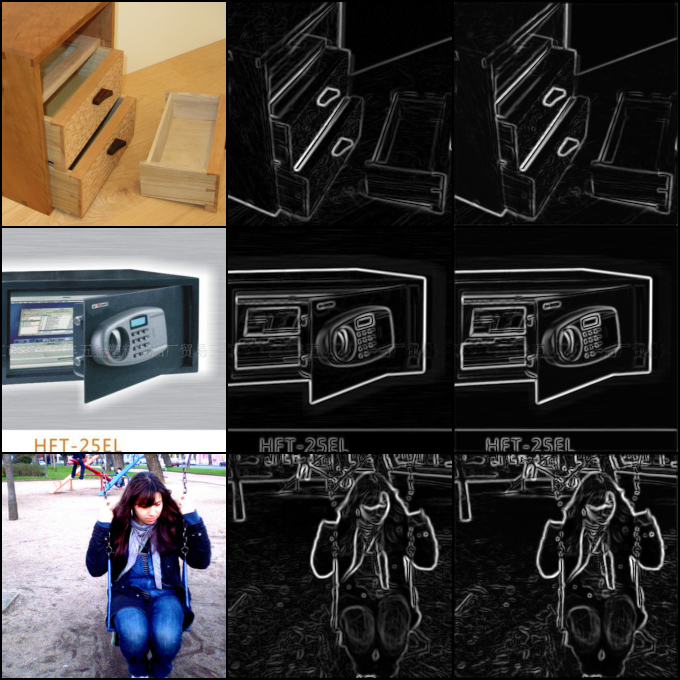
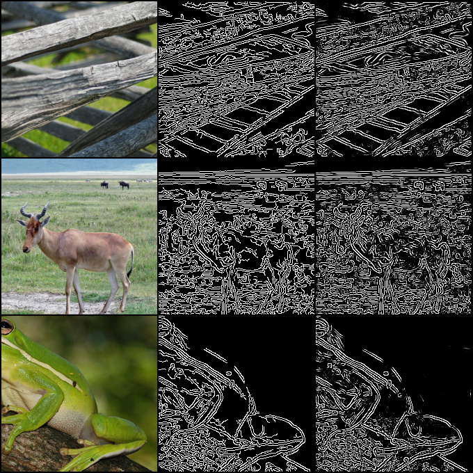
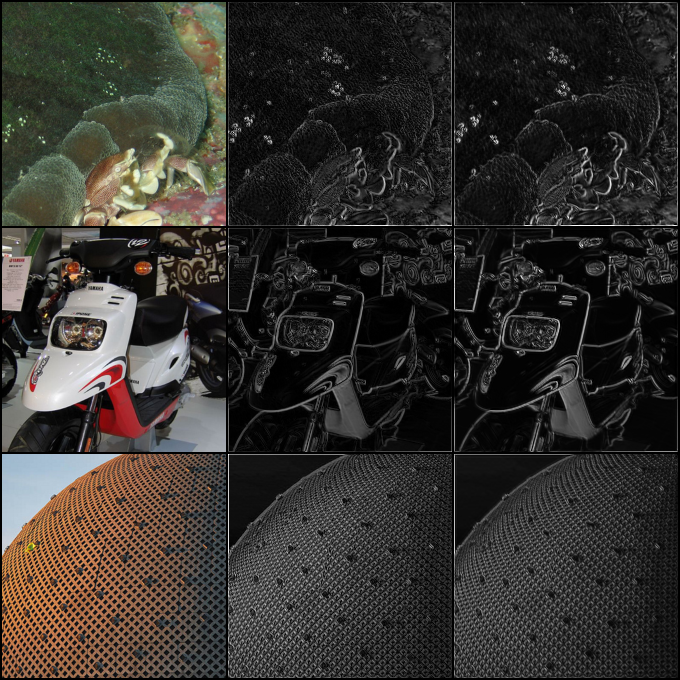
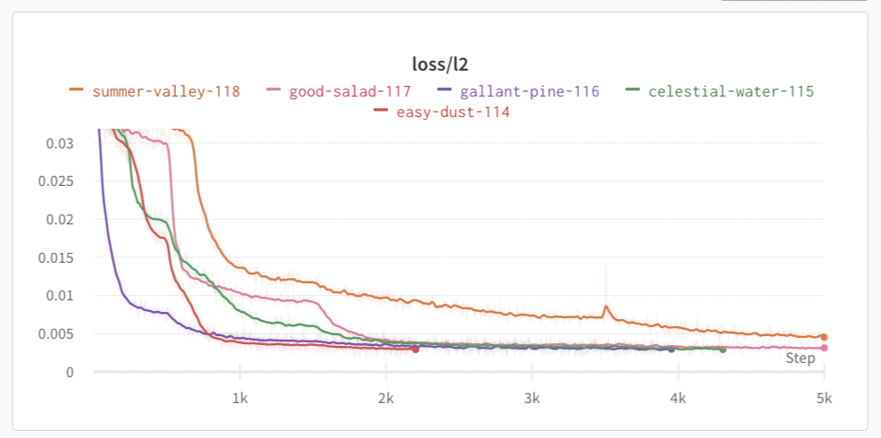
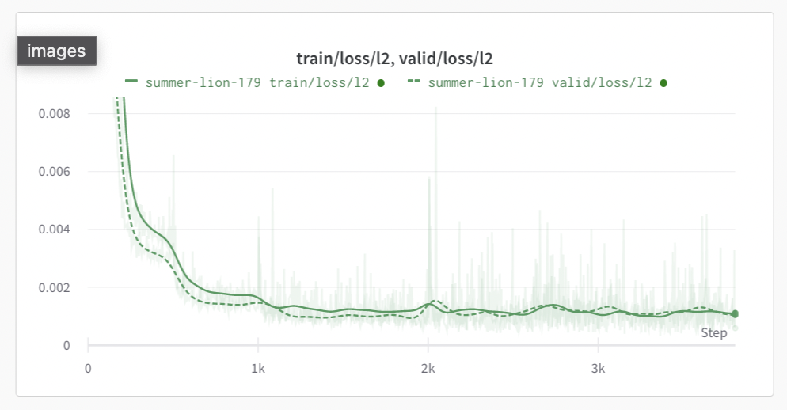
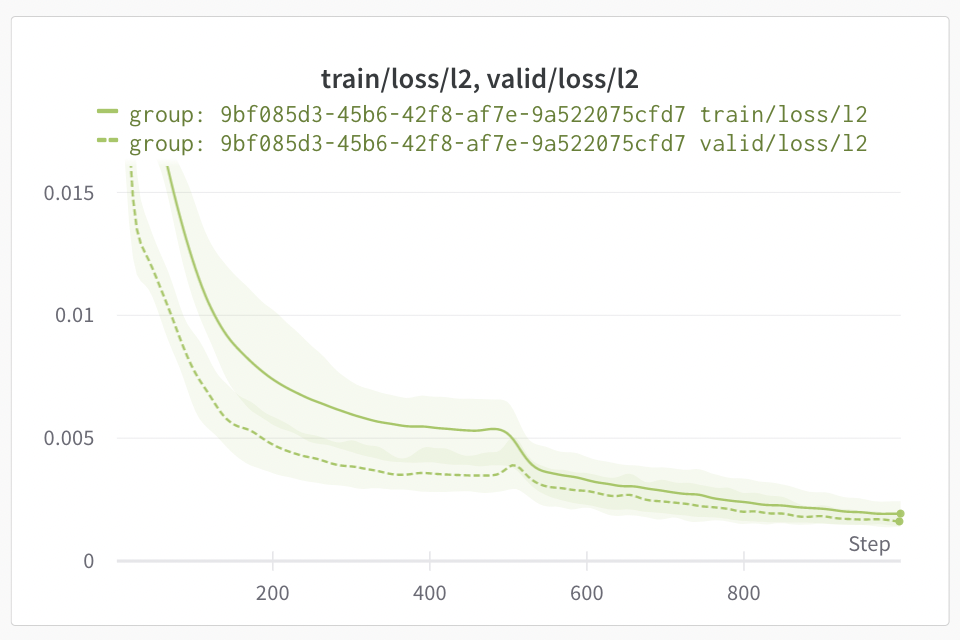

# **CLAPP**: **CL**assic **APP**roximation

This repo contains the code for various experiments on approximating the classical computer vision algorithms using deep learning. See [Demo Outputs](#demo-outputs) for results.

## Usage

Following is setup for running on local machine. 
<!-- If you plan to run via docker, skip to [docker section](#docker). -->

### Python & PyTorch

This code is compatible with Python >= 3.7. It has been tested with PyTorch 1.13 with Cuda 11.7. To install PyTorch, see [here](https://pytorch.org/get-started/locally/).

### Install other Dependencies

To install dependencies, run:

```bash
pip install -r requirements.txt
```

If you want to run experiments and visualize, you will also need to install and configure [wandb](https://wandb.ai/site) for logging by:

```bash
pip install wandb
wandb login <your wandb api key>
```

You can get your wandb api key from [here](https://wandb.ai/authorize).

### Dataset Setup

If you are going to use `imagenet-1k` dataset (which is default), you will need to Agree to the [ImageNet Terms of Use](https://huggingface.co/datasets/imagenet-1k) and then logging into your HuggingFace account by:

```bash
huggingface-cli login
```

### Running Experiments

To run experiments, you can customize the configuration in `configs/default.yaml` or create a new configuration file and then run:

```bash
python run_exp.py --config-file <path to config file> [OPTIONS]
```

### Running Training & Inference

To train and save the model, run:

```bash
python main.py train <model-save-path> [--config-file <path to config file>] [OPTIONS]
```

To run inference, run:

```bash
python main.py infer <model-save-path> <input-image-file> <output-image-file> [--config-file <path to config file>] [OPTIONS]
```

## Code organization

The code is organized as follows:

```
├── clapp
│   ├── data.py         # dataset configuration, loading and preprocessing
│   ├── model.py        # model definitions and configuration
│   ├── train.py        # training and evaluation
├── configs
│   ├── default.yaml    # default configuration with explanation of each parameter
|── images              # demo stuff
|-- main.py             # script to only train & save model or run inference
└── run_exp.py          # script to run detailed experiments with logging
```

## Configuration

Here is explanation of each parameter in the default configuration file: (from `configs/default.yaml`)

```yaml
num_runs: 10                # how many times to run the experiment, will be ignored if not using `run_exp.py` (good for confidence interval of loss curves)
num_resolutions: 2          # how many resolutions to train at (only for training data)
num_parallel_runs: 1        # how many runs to run in parallel, will be ignored if not using `run_exp.py`
experiment_name: null       # name of the experiment (if null, use generate uuid)
train_data:                 # configuration for training data
  name: imagenet-1k         # huggingface dataset name: https://huggingface.co/datasets/imagenet-1k
  split: train              # which split to use
  min_buffer: 2000          # minimum buffer size before starting training
  max_buffer: 8000          # maximum buffer size to keep in memory
  resize_base: 48           # initial resolution for image to be resized, will double for each resolution given by `num_resolutions`
  buffer_delay: 0.1         # Delay before pushing to buffer when it is full
  crop_size: 32             # initial crop size for image to be cropped, will double for each resolution given by `num_resolutions`
  image_key: image          # name of the key in the dataset that contains the image
  target_filter: sobel_3    # filter to apply to the image to get the target, see `clapp/data.py` for more details
valid_data:                 # configuration for validation data
  name: imagenet-1k         # huggingface dataset name, should be the same as `train_data.name` but can be different
  split: validation         # which split to use, should not be the same as `train_data.split` if using the same dataset
  min_buffer: 2000          # same as `train_data.min_buffer`
  max_buffer: 8000          # same as `train_data.max_buffer`
  resize_base: 256          # same as `train_data.resize_base` but it will not be doubled
  buffer_delay: 0.2         # same as `train_data.buffer_delay`
  crop_size: 224            # same as `train_data.crop_size` but it will not be doubled
  image_key: image          # same as `train_data.image_key`
  target_filter: sobel_3    # this value must be the same as `train_data.target_filter`
model:                      # configuration for the model
  capacity: 8               # number of filters to process in each layer
  num_layers: 4             # number of layers in the model
  input_channels: 3         # number of channels in the input image, should be 3 for RGB images
  output_channels: 1        # number of channels in the output image, should be 1 for grayscale images
  kernel_size: 3            # kernel size for the convolutional layers
  activation: gelu          # activation function to use, see `clapp/model.py` for more details
  flip_conv_norm: true      # whether to flip the order of convolution and normalization
  rezero: true              # whether to use rezero for the residual blocks
  reskip: true              # whether to use reskip for the residual blocks
train:                      # configuration for training
  device: auto              # device to use for training, can be `auto`, `cpu`, or `cuda`, or `mps`. `auto` will use `cuda` or `mps` if available, otherwise `cpu`
  batch_size: 256           # batch size to use for training, this will be halved for each resolution given by `num_resolutions`
  num_workers: 0            # number of workers to use for data loading, ideally should be kept 0 for best performance
  min_iterations: 500       # minimum number of iterations to train for
  max_iterations: 5000      # maximum number of iterations to train for
  stop_l2_loss: 0.005       # stops training if ema of l2 loss on validation is less than this value
  stop_loss_ema: 0.95       # amount of exponential moving average for l2 stop criteria
  learning_rate: 0.001      # learning rate
  output_dir: outputs       # directory where to stop output image
  output_log_interval: 100  # how frequently save the output image
  validation_interval: 5    # how frequently compute validation loss, smaller values cost performance, and larger value may cause longer time of convergnece and/or premature training stop
  min_lr: 1.0e-05           # for learning rate scheduler, how small the learning rate can go
  lr_cycle: 500             # cosine learning rate scheduler cycle length which will double after every cycle
  loss_type: all            # which loss to use, can be `all`, `l1`, `l2`, `lc`, see `clapp/model.py` for more details
```


## Demo Outputs

### Sobel 3x3:

<figure>
  
  <figcaption>
    Left: Input Image, Middle: cv2 Output, Right: Model Output
  </figcaption>
</figure>

### Sobel 5x5 with Canny:

<figure>
  
  <figcaption>
    Left: Input Image, Middle: cv2 Output, Right: Model Output
  </figcaption>
</figure>

### Random Sobel-like filter:

<figure>
  
  <figcaption>
    Left: Input Image, Middle: cv2 Output, Right: Model Output
  </figcaption>
</figure>

### Loss of multiple runs:



### Train vs. Validation Loss:



### Loss curve confidence interval:




## Progress & Future Work

- Dataset:
  - [x] Huggingface ImageNet-1k Streaming
  - [ ] Huggingface Downloaded Dataset
  - [ ] Local Image Folder
  - [ ] Synthetic Dataset
  - [x] Sobel 3x3 Filter
  - [x] Sobel 5x5 Filter with Canny
  - [x] Random 3x3 Convolutional Filter
  - [x] Random 3x3 Sobel-like Filter
