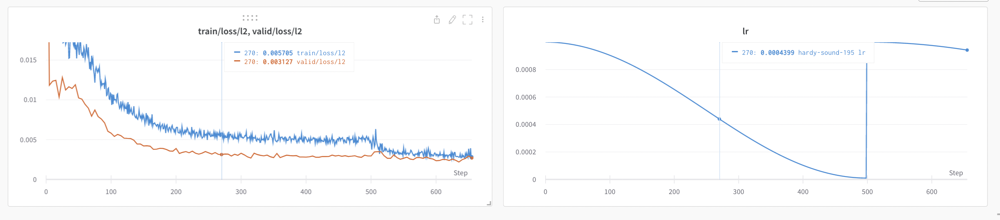

# **CLAPP**: **CL**assic **APP**roximation

This repo contains the code for various experiments on approximating the classical computer vision algorithms using deep learning. See [Demo Outputs](#demo-outputs) for results.

## Answers to the Questions

- **What if the image is really large or not of a standard size?**
  
    The model is extremely optimized for number of parameters, speed and memory usage (not training time). It requires 130 MegaFlops for inference on 224x224 image. The memory footprint is also very tiny. 4096x4096 image requires ~4GB of peak GPU memory. But if the images are larger than 8192x8192, they might not fit in most GPUs with 16GB memory so the image will need to be splitted and rejoined.

    Also, the current model does not use any down/up sample layers so the image of any size can be used.

- **What should occur at the edges of the image?**

    After testing `scripts/test_sobel.py` I realized cv2.Sobel first applies Sobel on the image and then padds the output with zeros. The normal conv layers in PyTorch do the opposite, so I inverted this process (in `clapp/model.py`) and now it approximates the results better.

- **Are you using a fully convolutional architecture?**

    Yes, it is a fully convolutional architecture. There are no fully connected layers as they are not needed in this case.

- **Are there optimizations built into your framework of choice (e.g. Pytorch) that can make this fast?**

    There can be various optimizations done for this like training time, inference time, model size and accuracy, etc. I personally did inference speed & model size optimization by educated guesses of hyperparameters. Libraries like `optuna` can be used to specify the optimization objective for hyperparameter search (in TODO).
    
    Further out-of-the-box optimizations can be achieved via `torch.jit` and `torch.quantization`. There are also techniques for network pruning which can help accelerate training of model on larger size and optimizing it for inference later. *PyTorch 2.0* has this new compile mode that can potentially speed up both training and inference.

- **What if you wanted to optimize specifically for model size?**

    The model is already very optimized for model size. It has ~2.5K parameters which are ~10KB in size. Further optimizations can be done using hyperparameter search, quantization and pruning.

- **How do you know when training is complete?**

    After many tests, I found out that a *validation loss* of `l2 < 0.005` is a good indicator that the model has generalized very well. Since the size of the model is very small, model cannot easily overfit and given the almost endless supply of imagenet images, the loss threshold is a very good indicator for convergence. However; to get much better approximation one can set this value to `0.001` at the cost of longer training time.

- **What is the benefit of a deeper model in this case? When might there be a benefit for a deeper model (not with a sobel kernel but generally when thinking about image to image transformations)?**

    Deeper model would converge way faster but there are a few issues here. It has higher possibility of overfitting especially when the dataset is small. For simple filter transformations, it would not make much sense to have huge models doing the same work. In some cases, it might require much longer (time) to converge. Also, models with downsample and upsample layers would require images to be multiple of a certain number. 

    However; in general, for much complex transformations, bigger models would be a better choice. While the current problem is where the information of the image is reduced, this type of filters can be easily be fit with smaller models. But when we need to generate new information like if we reverse the problem, i.e.,  generating image from sobel output, then a deeper model is a must requirement.

- **Generalization to random filters & Limitations**

    This code implements 2 variations of sobel (Simple Sobel 3x3, Sobel 5x5 with Canny) and 2 variations of random filter (random conv and random sobel-like conv). The current model generalizes very well to all of them. 

    The limitation of this model in general is that it uses GELU activation which approximates the output and is not the exact replica of that. Secondly, the capacity of model is limited right now. If we want to fit more complex filters, we might want to implement a deeper network with potentially down sample layers.

- **Some techniques and tricks implemented in this code**

    I have implemented multiple tricks for various optimizations. Some of them are the following:

    - Data Feeding: Since data is directly being streamed from the internet, it would be useless to just use it once and throw away. A paper suggested to keep using preprocessed data multiple times is better than to keep the GPU waiting for new data. So, `clapp/data.py`, I implemented data buffering which maintains a good buffer of data and keeps the GPU busy. This also helps in reducing the training time.

    - Model Optimization: I have implemented some of the very recent literature for the optimization of model in `clapp/model.py` like I found per channel ReZero layer and norm before conv to make training really fast. Also, I created a new layer `ReSkip` layer which is like ReZero but applies to the skip connection instead.

    - Training Optimization: In `clapp/train.py`, I have also included `log_cosh_loss` which I found to be a good loss. EMA for l2 loss is helpful to avoid premature stoppage of training due to noise. I also found cosine annealing lr scheduler to be very useful for model to avoid getting stuck in local minima (as shown by the loss curves below). Another useful thing was progressive training by increasing image size. Since, Sobel output is mostly black, when training on larger images, model would usually get stuck outputting zeros but with smaller images, it converged really quickly.

## Usage

Following is setup for running on local machine. 
<!-- If you plan to run via docker, skip to [docker section](#docker). -->

### Python & PyTorch

This code is compatible with Python >= 3.7. It has been tested with PyTorch 1.13 with Cuda 11.7. To install PyTorch, see [here](https://pytorch.org/get-started/locally/).

### Install other Dependencies

To install dependencies, run:

```bash
pip install -r requirements.txt
```

If you want to run experiments and visualize, you will also need to install and configure [wandb](https://wandb.ai/site) for logging by:

```bash
pip install wandb
wandb login <your wandb api key>
```

You can get your wandb api key from [here](https://wandb.ai/authorize).

### Dataset Setup

If you are going to use `imagenet-1k` dataset (which is default), you will need to Agree to the [ImageNet Terms of Use](https://huggingface.co/datasets/imagenet-1k) and then logging into your HuggingFace account by:

```bash
huggingface-cli login
```

### Running Experiments

To run experiments, you can customize the configuration in `configs/default.yaml` or create a new configuration file and then run:

```bash
python run_exp.py --config-file <path to config file> [OPTIONS]
```

### Running Training & Inference

To train and save the model, run:

```bash
python main.py train <model-save-path> [--config-file <path to config file>] [OPTIONS]
```

To run inference, run:

```bash
python main.py infer <model-save-path> <input-image-file> <output-image-file> [--config-file <path to config file>] [OPTIONS]
```

## Code organization

The code is organized as follows:

```
├── clapp
│   ├── data.py         # dataset configuration, loading and preprocessing
│   ├── model.py        # model definitions and configuration
│   ├── train.py        # training and evaluation
├── configs
│   ├── default.yaml    # default configuration with explanation of each parameter
|── images              # demo stuff
|-- main.py             # script to only train & save model or run inference
└── run_exp.py          # script to run detailed experiments with logging
```

## Configuration

Here is explanation of each parameter in the default configuration file: (from `configs/default.yaml`)

```yaml
num_runs: 10                # how many times to run the experiment, will be ignored if not using `run_exp.py` (good for confidence interval of loss curves)
num_resolutions: 2          # how many resolutions to train at (only for training data)
num_parallel_runs: 1        # how many runs to run in parallel, will be ignored if not using `run_exp.py`
experiment_name: null       # name of the experiment (if null, will generate uuid)
train_data:                 # configuration for training data
  name: imagenet-1k         # huggingface dataset name: https://huggingface.co/datasets/imagenet-1k
  split: train              # which split to use
  min_buffer: 2000          # minimum buffer size before starting training
  max_buffer: 8000          # maximum buffer size to keep in memory
  resize_base: 96           # initial resolution for image to be resized, will double for each resolution given by `num_resolutions`
  buffer_delay: 0.1         # Delay before pushing to buffer when it is full
  crop_size: 64             # initial crop size for image to be cropped, will double for each resolution given by `num_resolutions`
  image_key: image          # name of the key in the dataset that contains the image
  target_filter: sobel_3    # filter to apply to the image to get the target, see `clapp/data.py` for more details
valid_data:                 # configuration for validation data
  name: imagenet-1k         # huggingface dataset name, should be the same as `train_data.name` but can be different
  split: validation         # which split to use, should not be the same as `train_data.split` if using the same dataset
  min_buffer: 2000          # same as `train_data.min_buffer`
  max_buffer: 8000          # same as `train_data.max_buffer`
  resize_base: 256          # same as `train_data.resize_base` but it will not be doubled
  buffer_delay: 0.2         # same as `train_data.buffer_delay`
  crop_size: 224            # same as `train_data.crop_size` but it will not be doubled
  image_key: image          # same as `train_data.image_key`
  target_filter: sobel_3    # this value must be the same as `train_data.target_filter`
model:                      # configuration for the model
  capacity: 8               # number of filters to process in each layer
  num_layers: 4             # number of layers in the model
  input_channels: 3         # number of channels in the input image, should be 3 for RGB images
  output_channels: 1        # number of channels in the output image, should be 1 for grayscale images
  kernel_size: 3            # kernel size for the convolutional layers
  activation: gelu          # activation function to use, see `clapp/model.py` for more details
  flip_conv_norm: true      # whether to flip the order of convolution and normalization
  rezero: true              # whether to use rezero for the residual blocks
  reskip: true              # whether to use reskip for the residual blocks
train:                      # configuration for training
  device: auto              # device to use for training, can be `auto`, `cpu`, or `cuda`, or `mps`. `auto` will use `cuda` or `mps` if available, otherwise `cpu`
  batch_size: 256           # batch size to use for training, this will be halved for each resolution given by `num_resolutions`
  num_workers: 0            # number of workers to use for data loading, ideally should be kept 0 for best performance
  min_iterations: 500       # minimum number of iterations to train for
  max_iterations: 5000      # maximum number of iterations to train for
  stop_l2_loss: 0.005       # stops training if ema of l2 loss on validation is less than this value
  stop_loss_ema: 0.95       # amount of exponential moving average for l2 stop criteria
  learning_rate: 0.001      # learning rate
  output_dir: outputs       # directory where to stop output image
  output_log_interval: 100  # how frequently save the output image
  validation_interval: 5    # how frequently compute validation loss, smaller values cost performance, and larger value may cause longer time of convergnece and/or premature training stop
  min_lr: 1.0e-05           # for learning rate scheduler, how small the learning rate can go
  lr_cycle: 500             # cosine learning rate scheduler cycle length which will double after every cycle
  loss_type: all            # which loss to use, can be `all`, `l1`, `l2`, `lc`, see `clapp/model.py` for more details
```


## Demo Outputs

### Sobel 3x3:

<figure>
  
  <figcaption>
    Left: Input Image, Middle: cv2 Output, Right: Model Output
  </figcaption>
</figure>

### Sobel 5x5 with Canny:

<figure>
  
  <figcaption>
    Left: Input Image, Middle: cv2 Output, Right: Model Output
  </figcaption>
</figure>

### Random Sobel-like filter:

<figure>
  
  <figcaption>
    Left: Input Image, Middle: cv2 Output, Right: Model Output
  </figcaption>
</figure>

### Loss of multiple runs:


### Train vs. Validation Loss:



### Loss curve confidence interval:


## Progress & Future Work

- Dataset:
  - [x] Huggingface ImageNet-1k Streaming
  - [ ] Huggingface Downloaded Dataset
  - [ ] Local Image Folder
  - [ ] Synthetic Dataset
  - [x] Sobel 3x3 Filter
  - [x] Sobel 5x5 Filter with Canny
  - [x] Random 3x3 Convolutional Filter
  - [x] Random 3x3 Sobel-like Filter
  - [ ] Filter Customizations
  - [ ] Other Standard Filters
  - [ ] Accelerating Filters with GPU & Batching
- Model:
  - [x] Basic Image to Image Model
  - [x] ReZero Residual Blocks
  - [x] Reskip Residual Blocks (custom trick)
  - [x] Various Activations
  - [x] Swap Normalization and Convolution
  - [ ] Downsample & Upsample Blocks
  - [ ] [U<sup>2</sup>Net](https://github.com/xuebinqin/U-2-Net/blob/master/model/u2net.py) model support
  - [ ] Other standard image to image models
  - [x] Ultra Optimized for Parameter Count (currently 2505 parameters)
  - [ ] Optimization for Convergence Speed
  - [ ] Optimization for Inferencing Speed
- Training:
  - [x] Basic Training Loop
  - [x] Wandb Integration
  - [x] Learning Rate Scheduler
  - [x] Stopping Criteria
  - [x] Multi-resolution Training
  - [ ] Optuna for Hyperparameter Tuning
  - [ ] Mixed Precision Training
  - [ ] More losses
- UX:
  - [x] Configuration Management
  - [x] Basic CLI for Experimentation
  - [x] Basic CLI for Training & Inference
  - [ ] Auto Save Configuration & model for each run
  - [ ] Local run grouping for experiments
  - [ ] [Better logger](https://github.com/Delgan/loguru)
  - [ ] Support for extremely large images
- Ops:
  - [ ] CPU Dockerfile
  - [ ] GPU Dockerfile
  - [ ] ONNX Export
  - [ ] CI/CD for docker image
  - [ ] Kubernetes Training
  - [ ] CI/CD for training
  - [ ] Kubernetes Inference
  - [ ] CI/CD for inference/deployment
- Docs:
  - [x] Basic Docs (this README)
  - [ ] Docs for Running Docker
  - [ ] Detailed docs for each module
  - [ ] Detailed report on the experiments and model optimization
  - [ ] Ablation studies
